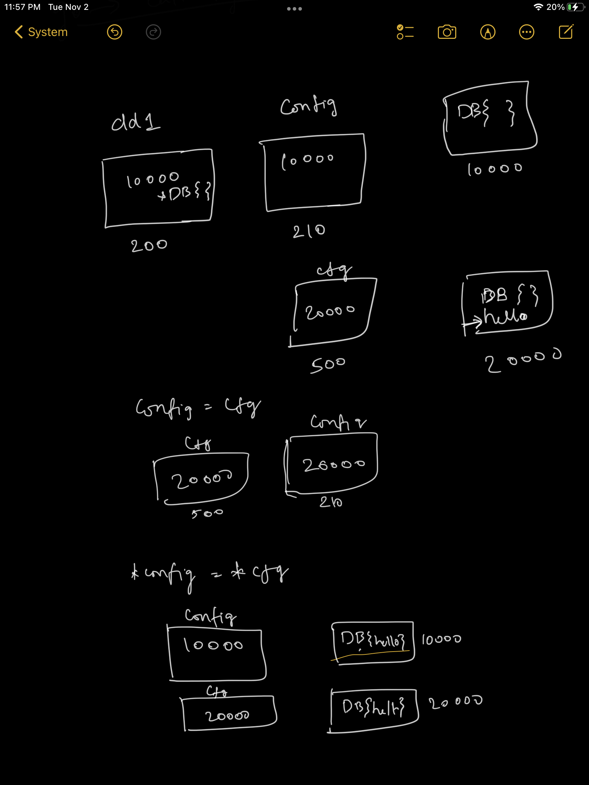

1. double pointers

A pointer (whose value is another variable's address) which points to another pointer

2. copying a pointer to another pointer copies the address

3. copying a de-referenced pointer to another de-referenced pointer updates the value of the one to another

https://gist.github.com/viggy28/604cda186ff1b872d562b31ca3976732

```go
package main

import "fmt"

type DB struct {
	Name string
}

// double pointer
// a pointer which points to another pointer
func wrapperFunc(config **DB) func() error {
	return func() error {
		cfg := &DB{}
		(*cfg).Name = "hello"
		*config = cfg
		return nil
	}
}

// config = cfg assigns the address which cfg has to config
// hence dd1 in main() doesn't get impacted
func wrapperFunc1(config *DB) func() error {
	return func() error {
		cfg := &DB{}
		fmt.Println("address of config: ", &config)
		fmt.Printf("  wrapperFunc1 A: config is %p, cfg is %p\n", config, cfg)
		cfg.Name = "hello"
		config = cfg
		fmt.Printf("  wrapperFunc1 B: config is %p, cfg is %p\n", config, cfg)
		return nil
	}
}

// *config = *cfg value at address cfg has will be copied to value at the address that config has
// hence dd2 in main() does gets updated
func wrapperFunc2(config *DB) func() error {
	return func() error {
		cfg := &DB{}
		fmt.Printf("  wrapperFunc2 A: config is %p, cfg is %p\n", config, cfg)
		cfg.Name = "hello"
		fmt.Println("value at ", *cfg)
		*config = *cfg
		fmt.Printf("  wrapperFunc2 B: config is %p, cfg is %p\n", config, cfg)
		return nil
	}
}

func wrapperFunc3(config *DB) func() error {
	return func() error {
		config.Name = "hello"
		return nil
	}
}

func wrapperFunc4(config DB) func() error {
	return func() error {
		config.Name = "hello"
		return nil
	}
}

func main() {
	{
		var d *DB
		fn := wrapperFunc(&d)
		fn()
		fmt.Printf("d.Name: %q\n", d.Name)
	}

	{
		dd1 := &DB{}
		fmt.Println("address of dd1: ", &dd1)
		fmt.Printf("main A: dd1 is %p\n", dd1)
		fn1 := wrapperFunc1(dd1)
		fn1()
		fmt.Printf("main B: dd1 is %p\n", dd1)
		fmt.Printf("dd1.Name: %q\n", dd1.Name)
	}

	{
		dd2 := &DB{}
		fmt.Printf("main C: dd2 is %p\n", dd2)
		fn2 := wrapperFunc2(dd2)
		fn2()
		fmt.Printf("main D: dd2 is %p\n", dd2)
		fmt.Printf("dd2.Name: %q\n", dd2.Name)
	}

	{
		dd3 := &DB{}
		fn3 := wrapperFunc3(dd3)
		fn3()
		fmt.Printf("dd3.Name: %q\n", dd3.Name)
	}

	{
		dd4 := DB{}
		fn4 := wrapperFunc4(dd4)
		fn4()
		fmt.Printf("dd4.Name: %q\n", dd4.Name)
	}
}
```

