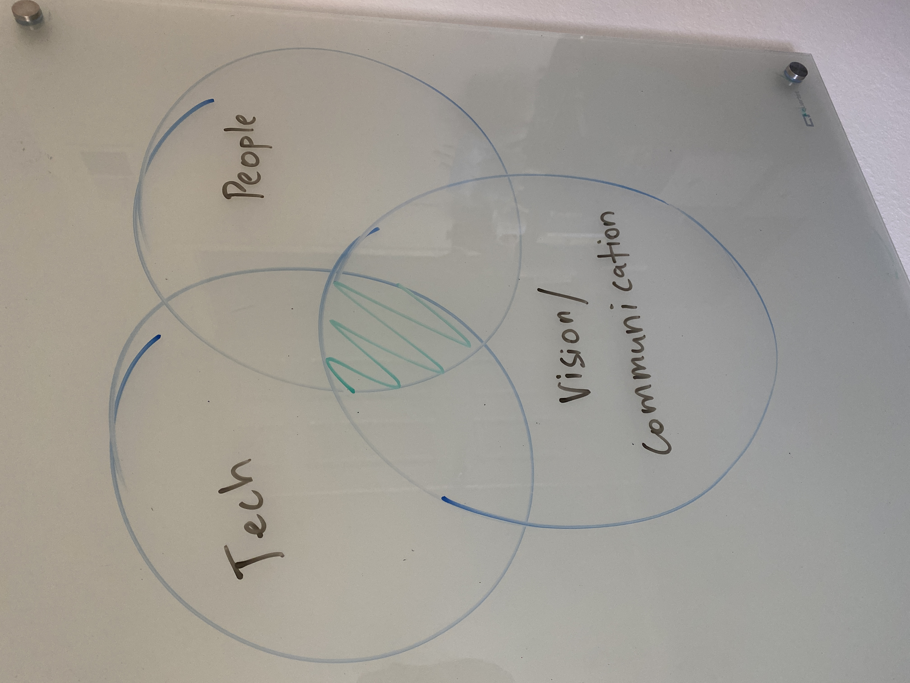

Last week, I got promoted to Engineering Manager (EM) of the Database team at Cloudflare. I joined the team almost 3 years ago. A senior team member and myself were hired to form a then dedicated database team. I have been enjoying it and the team is amazing to work with. Great people. Opportunities came to either advance on the Individual Contributor (IC) or the leadership side. I picked the latter. My thoughts on why did I transition to leadership.

If you have known me, you know I enjoy solving technical challenges. Have done a lot of Ops work, on-call, migrations (once a DBA, you are always a DBA. Isn't it). I understand Ops doesn't get the same limelight as Dev but I enjoy it. So, then why didn't I just continue doing it?

I went to the drawing board last year and asked myself what do I think my strengths are? Is it Tech? I realized (or agreed) that I am actually an average engineer. I wouldn't put myself in the top percentiles. It took a bit of maturation to accept that answer. Part of me wanted to try to become that top engineer. However, I realized it's okay. I don't need to fight that but rather pursue what I genuinely enjoy (at this point in my career) which is a combination of Tech + People + Vision/Communication. One of my teammates once mentioned *Vignesh, actually, there is more need for **good** managers than engineers*.

I felt I am ready to solve broader challenges. Time will answer how I fare.

Why do I like dealing with people? After all, I reached where I am today mainly because of the people. I am so grateful every day to my Professors in grad schools who took a chance on me, my managers who trusted that I can do the job, my teammates who have been teaching me throughout my career, and peers who bear with me. Finally, my family genuinely supports me with whatever I want to do.  It's almost always people who are helping me achieve. It's time for me to repay.

Another area lately that I have been working on is creating a vision, communicating it (to a wider audience), and letting the community thrive. Stay tuned, I will post more on this.

I would love to hear from folks who were/are in the same boat. What decisions did you take and how did it turn out?

BTW, our team consists of 5 amazing people and we are growing. Checkout the [open positions](https://boards.greenhouse.io/cloudflare/jobs/3585928). Happy to answer any questions.