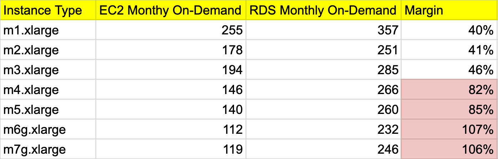

I was writing an article on the topic "less spoken costs of managed databases" and one question that the editor asked is how much margin does RDS makes compared to running a postgres instance on EC2? That intrigued me and honestly I never did the math so far. I have been using AWS managed databases since 2016 and I thought what's a better time to do analysis about Cloud than today ?!

I started with comparing instance types between EC2 and RDS. These are the same VMs (EC2) that's powering RDS. Correct me if I am wrong.

When I saw more than 100% margin, I wasn't sure that I making any mathematical error or not. My instant reaction was perhaps there is difference in other resources. However, I couldn't find any difference in network performance which is up to 12.5 Gigabit and it's 4 vCPUs with 16 GiB memory. Same between both. My understanding is that the newer generation of instances are generally cheaper. However, that's where the margins are also higher.

So far I analyzed only the instance type. Next I looked into the storage cost (EBS). These are compared with same IOPS, throughput and no snapshots enabled. 

Looks like gp3 is anomaly. I used AWS cost calculator and it had few additonaly notes on that. 

**Open questions:**

[1]. What is the difference between vanilla EC2 instance and RDS instance?

[2]. Is there any free tier in GP3 volume type for RDS?

**References:**

https://instances.vantage.sh/rds/?cost_duration=monthly

https://instances.vantage.sh/?cost_duration=monthly

https://rbranson.medium.com/rds-pricing-has-more-than-doubled-ef8c3b7e5218

